# Will a bank customer accept a bank term deposit offer?

## **1. Business Understanding**

A Portuguese banking institution conducted multiple direct marketing campaigns for the bank term deposit product between May 2008 and November 2010. During these 17 campaigns, bank clients were contacted and offered an attractive term deposit application over the phone. Information related to the bank client, campaign interactions and results (e.g. whether the client subscribed to the term deposit application) was captured in a dataset.

The business objective is to increase the effectiveness and efficiency of future bank term deposit direct marketing campaigns. To address this business objective, the aim of this project is to identify a predictive classification machine learning model which would effectively predict whether a client would subscribe to a bank term deposit product.

## **2. Methodology**

The Cross-Industry Standard Process for Data Mining (CRISP-DM) framework is applied to guide this effort. The framework includes six phases: business understanding, data understanding, data preparation, modeling, evaluation, and deployment.

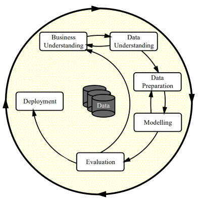

                         **Phases of the CRISP-DM Process Model for Data Mining**

After understanding the business objectives, the collected data will be explored by using visualizations and probability distributions to form initial findings and hypothesis. Then, data will be cleaned and prepared to handle any integrity issues. Features will be engineered for modelling. Next, four predictive classification models will be built and fine-tuned with optimal parameters. They are **K-nearest Neighbors (KNN), Logistic Regression (LR), Decision Trees (DT), and Support Vector Machines (SVM) classification models** with a cross-validation method applied. Lastly, these models or classifiers will be compared so that the best model, based on a set of predefined criteria, will be identified and recommended.

Two datasets were used. Four models were trained on 10% of the imbalanced 7-feature-dataset to compare the performance and to eliminate two models. Then, the two remaining models were trained and assessed on the imbalanced full 7-feature-dataset. Finally, the best model was selected and interpreted.

## **3. Data Understanding**

### **3.1 Data Overview**

The original dataset contains information about 40,000 observations. The dataset describes different attributes related to bank client information, campaign interactions and socioeconomic indicators. Below are the attributes and descriptions of the initial data:

| **No.**           | **Attribute Name** | **Attribute Description**                                                                                                                                                                                                                                                                                                                                                                                          | **Attribute Type** |
| ----------------- | ------------------ | ------------------------------------------------------------------------------------------------------------------------------------------------------------------------------------------------------------------------------------------------------------------------------------------------------------------------------------------------------------------------------------------------------------------ | ------------------ |
| **Bank Client**   |                    |                                                                                                                                                                                                                                                                                                                                                                                                                    |                    |
| 1                 | age                | age                                                                                                                                                                                                                                                                                                                                                                                                                | int64              |
| 2                 | job                | type of job (categorical: "admin.", "blue-collar", "entrepreneur", "housemaid", "management", "retired", "self-employed", "services", "student", "technician", "unemployed", "unknown")                                                                                                                                                                                                                            | object             |
| 3                 | marital            | marital status (categorical: "divorced", "married", "single", "unknown"; note: "divorced" means divorced or widowed)                                                                                                                                                                                                                                                                                               | object             |
| 4                 | education          | (categorical: "basic.4y", "basic.6y", "basic.9y", "high.school", "illiterate", "professional.course", "university.degree", "unknown")                                                                                                                                                                                                                                                                              | object             |
| *5*               | default            | has credit in default? (categorical: "no", "yes", "unknown")                                                                                                                                                                                                                                                                                                                                                       | object             |
| 6                 | housing            | has housing loan? (categorical: "no", "yes", "unknown")                                                                                                                                                                                                                                                                                                                                                            | object             |
| 7                 | loan               | has personal loan? (categorical: "no", "yes", "unknown")                                                                                                                                                                                                                                                                                                                                                           | object             |
| **Campaign**      |                    |                                                                                                                                                                                                                                                                                                                                                                                                                    |                    |
| 8                 | contact            | contact communication type (categorical: "cellular", "telephone")                                                                                                                                                                                                                                                                                                                                                  | object             |
| 9                 | month              | last contact month of year (categorical: "jan", "feb", "mar", ..., "nov", "dec")                                                                                                                                                                                                                                                                                                                                   | object             |
| 10                | day_of_week        | last contact day of the week (categorical: "mon","tue","wed","thu","fri")                                                                                                                                                                                                                                                                                                                                          | object             |
| 11                | duration           | last contact duration, in seconds (numeric). Important note: this attribute highly affects the output target (e.g., if duration=0 then y="no"). Yet, the duration is not known before a call is performed. Also, after the end of the call y is obviously known. Thus, this input should only be included for benchmark purposes and should be discarded if the intention is to have a realistic predictive model. | int64              |
| **Others**        |                    |                                                                                                                                                                                                                                                                                                                                                                                                                    |                    |
| 12                | campaign           | number of contacts performed during this campaign and for this client (numeric, includes last contact)                                                                                                                                                                                                                                                                                                             | int64              |
| 13                | pdays              | number of days that passed by after the client was last contacted from a previous campaign (numeric; 999 means client was not previously contacted)                                                                                                                                                                                                                                                                | int64              |
| 14                | previous           | number of contacts performed before this campaign and for this client (numeric)                                                                                                                                                                                                                                                                                                                                    | int64              |
| 15                | poutcome           | outcome of the previous marketing campaign (categorical: "failure", "nonexistent", "success")                                                                                                                                                                                                                                                                                                                      | object             |
| **Socioeconomic** |                    |                                                                                                                                                                                                                                                                                                                                                                                                                    |                    |
| 16                | emp.var.rate       | employment variation rate - quarterly indicator (numeric)                                                                                                                                                                                                                                                                                                                                                          | float64            |
| 17                | cons.price.idx     | consumer price index - monthly indicator (numeric)                                                                                                                                                                                                                                                                                                                                                                 | float64            |
| 18                | cons.conf.idx      | consumer confidence index - monthly indicator (numeric)                                                                                                                                                                                                                                                                                                                                                            | float64            |
| 19                | euribor3m          | euribor 3 month rate - daily indicator (numeric)                                                                                                                                                                                                                                                                                                                                                                   | float64            |
| 20                | nr.employed        | number of employees - quarterly indicator (numeric)                                                                                                                                                                                                                                                                                                                                                                | float64            |
| **Target**        |                    |                                                                                                                                                                                                                                                                                                                                                                                                                    |                    |
| 21                | y                  | has the client subscribed to a term deposit? (binary: "yes","no")                                                                                                                                                                                                                                                                                                                                                  | object             |

### **3.2 Exploratory Data Analysis**

#### **3.2.1 Data Quality**

The quality of the dataset is very decent. While there are no empty or NULL values, missing information was coded as “unknown”. Twenty percent of the "default" attribute was missing or "unknown". Other attributes have “unknown” values below 5%. The “unknown” values can be later dropped, imputed or used as a category.

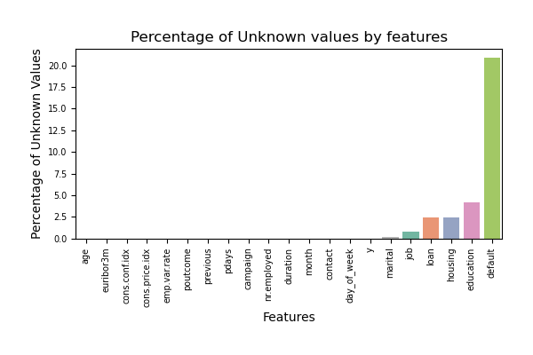

Outliers present in features: age, duration, campaign, pdays, previous and cons.conf.idx.

#### **3.2.2 Target Variable**

The name of the target “y” column is changed to “subscribed” for ease of reading.

The pie chart below illustrates that the success rate is only 11%. In other words, the number of times when the bank contacted their clients who then subscribed to the bank term deposit was 11% of the total number of times the bank contacted the prospects.

#### **3.2.3 Relationships of the Target Variable and Numeric Features**

- Prospects tend to subscribe when they are over 60. However, observations concentrate at the age of 30-40 and people tend to accept less than reject at this age.
- Acceptance concentrates at the first contact (campaign = 1)
- Client who was not previously contacted is mostly not subscribed.
- People tend to subscribe more when the employment variation rate is below zero or Euribor rate below 3 or number of employees is below 5,100.

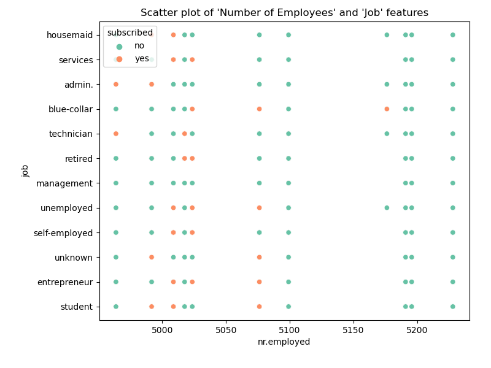

#### **3.2.4 Relationships of the Target Variable and Categorical Features**

- People who are married or have a college degree or do not have a loan or are not in a default status also tend to subscribe.
- People are more likely to accept if they had previously accepted in the prior campaign.

#### **3.2.5 Hypothesis**

- For the bank client information attributes, it seems that people with higher education or are not in a defaulted status or more senior / retired tend to subscribe to the offer.
- Campaign interaction related attributes also contribute to the subscription outcome. While "duration" of a contact or call is considerably correlated with the subscription, this attribute, as mentioned in the dataset description, is not useful in building a predictive model because the call duration is not known before the contact. However, people tend to subscribe when the outcome of the previous campaign was successful (e.g. when they previously accepted the term deposit offer from the previous campaign).
- Social and economic context attributes appear to play an important role in the term deposit acceptance rate. Prospects tend to accept the termed deposit offer when the number of employees is less than 5,100 or the Euribor rate is below 3, or employment variation rate is negative.
- If only bank client information attributes are available for prediction or classification, the performance of the classification models might not be impressive. However, it should not impede the objective of this project which is to recommend a classification model.

## **4. Data Preparation**

### **4.1 Data Cleaning and Selection**

- **Removing features:** Only the first 7 features ('age', 'job', 'marital', 'education', 'default', 'housing', 'loan') and the target variable 'subscribed' were used for this project.
- **Removing duplicate observations:** While there are twelve duplicate rows or observations in the original dataset, 26,097 duplicates were removed after the unused attributes were dropped. When using only 7 features related to client bank information, both the dimension and the number of samples or observations were reduced. The original dataset has more than 41,000 entries. As a client was possibly contacted multiple times throughout 17 campaigns from May 2008 and November 2010, client bank information attributes were recorded as duplicate entries in the original dataset. After removing features related to campaign interactions, socioeconomic and removing duplicate entries related to bank information, the number of entries reduced more than half, leaving approximately 15,000 observations in the dataset which are used for this project.
- **Handling “unknown” values:** Missing values were recorded as “unknown”. It was decided not to drop the data in order to minimize data loss; it was also decided not to impute but keep them as-is and used “unknown” as one of the categories of the features.
- **Handling outliers:** Outliers were detected but were not removed and kept as-is.

### **4.2. Data Transformation**

To narrow the scope of this project, it was requested to only use the first 7 features which are related to bank client information. Therefore, only these attributes were transformed and used for the modeling.

- **Feature encoding:** Given the “age” feature hypothesis derived from the data exploratory process, discretization was applied to this feature:
  
  - bins = [0, 30, 50, 60, infinity]
  
  - labels = ['early_career', 'mid_career', 'late_career', 'senior']

Categorical features are encoded based on type (ordinal or nominal). Below is the list of ordinal categorical features and their encoded order:

| **Ordinal Features** | **Values and Orders**                                                                                                  |
| -------------------- | ---------------------------------------------------------------------------------------------------------------------- |
| education            | "unknown”, “illiterate", "basic.4y", "basic.6y", "basic.9y", "high.school", "professional.course", "university.degree" |

Nominal categorical features were encoded by using the one-hot encoding method although this method would increase the dimension of the dataset.

- **Scaling:** Data were scaled with the MinMaxScaler.

### 4.3. Correlation Matrix

Based on the correlation matrix below, there is no feature that is strongly correlated with the target variable.

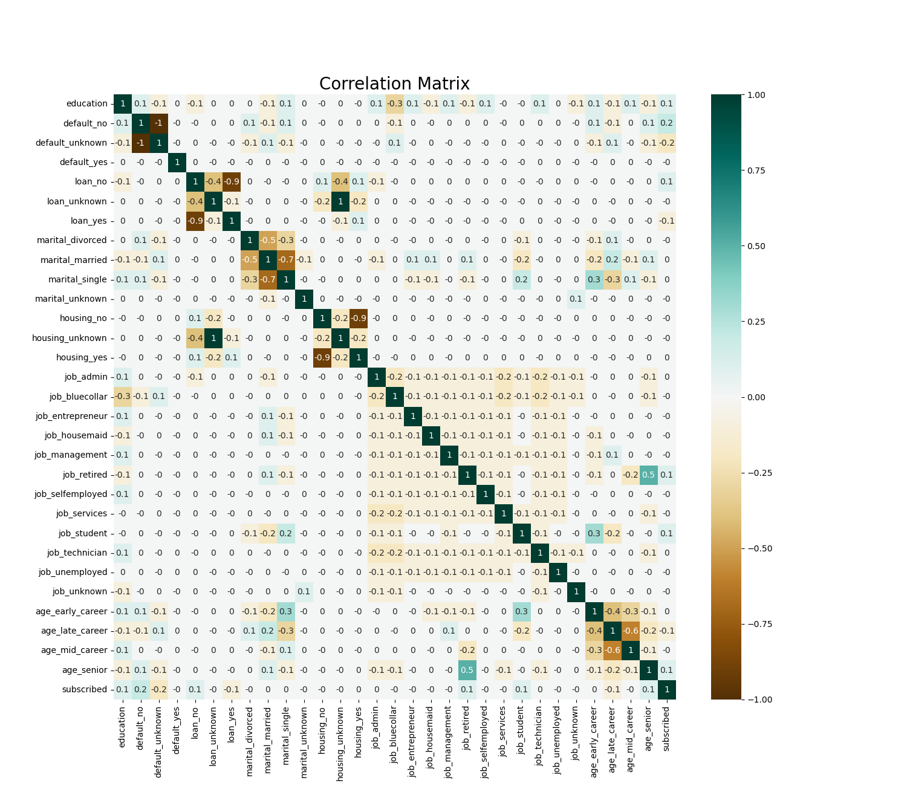

### **4.4. Feature Selection**

The dimension of the dataset was reduced by using only the first 7 features related to client bank information. In addition, different methods were explored to select the important transformed features and to reduce the dimension of the transformed dataset. Features selected by the hierarchy clustering method with 1 as the threshold were used to train the model. They are: **'education', 'default_no', 'default_yes', 'loan_no', 'loan_unknown', 'marital_divorced', 'marital_unknown', 'housing_no', 'job_retired', 'age_early_career'**.

## **5. Modeling**

### **5.1 Train Models**

- **Model technique:** Four classification models were built. They are K-nearest Neighbors (KNN), Logistic Regression (LR), Decision Trees (DT), and Support Vector Machines (SVM).

- **Cross-validation:** The dataset was split into trained set and test set. When splitting the dataset, the class proportion was preserved with the “stratify” option. The test set was held out for final evaluation. Train dataset was then split into smaller sets to train, tune hyper-parameters, and validate the models as part of the stratified k-fold cross-validation method.

- **Hyperparameter tuning:** Instead of using the exhaustive and computationally expensive grid searching with GridSearchCV, randomized parameter optimization was used to tweak model performance for optimal results due to its speed.

- **Model Selection Criteria:**
  
  - **Model performance metrics:** The conventional and institutive accuracy score which is calculated by the number of correct predictions divided by the total number of predictions is not used because the dataset is imbalanced. If a “lazy” model were built and always predicted the majority class or negative class (“not subscribed” or “0”), the accuracy of this “lazy” model would be 89% because 89% of the observations in the dataset are “not subscribed”. Instead, other measuring metrices are used to evaluate the model performance. They are:
    
    - **Balanced Accuracy**: The calculation of the accuracy score was adjusted to address the inflated performance due to the imbalanced data. The balanced accuracy score is calculated as the following:
      
      Balanced Accuracy = (Sensitivity + Specificity) / 2
      
      Sensitivity = TP / (TP + FN) and Specificity = TN / (TN + FP)
      
      Where:
      
      TP: true positive (the correctly predicted positive class)
      
      TN: true negative (the correctly predicted negative class)
      
      FP: false positive (the incorrectly predicted positive class)
      
      FN: false negative (the incorrectly predicted negative class)
    
    - **F1 score**: F1 score combines Precision and Recall. A model with a high Precision score might not find all the positives (“subscribed”), but the ones classified as positive by the high Precision model are almost certain to be correct. In contrast, a high Recall model would find almost all the positives, but it might incorrectly classify some negative instances (“not subscribed”) as positive class (“subscribed”).
      
      There is a trade-off between Precision and Recall. While we would like to have a model to correctly classify a client as “subscribed”, we would not want to miss out on too many clients due to a pessimistic model. On the other hand, we would not want to waste too many resources on clients or leads who are not likely to subscribe to the bank term deposit. The F1 score is the harmonic mean of the two competing Precision and Recall scores. It is calculated as the following and the contribution of Precision and Recall to the F1 score are equal:
      
      F1 = 2 \* (Precision \* Recall) / (Precision + Recall)
      
      F1 = 2 \* TP / (2 \* TP + FN + FP)
      
      Models were trained with a focus on the F1 score.
      
      In addition to the Balanced Accuracy and F1 scores, the confusion matrix, the precision-recall curve and ROC-AUC (Receiver Operating Characteristic – Area Under Curve) were used during the evaluation process.
  
  - **Other considerations:** In addition to the model performance metrics mentioned above, speed or train time and ease of interpretation were also considered when selecting the model.

- **Dataset:** Some algorithms such as SVM are computationally expensive. Therefore, four models were trained and assessed on 10% of the 7-feature-dataset first. Fit time and score time curves as well as learning curves were plotted to facilitate the assessment. Then, two models were eliminated. The remaining two models were then trained and assessed on the full 7-feature-dataset. Lastly, the selected or recommended model was interpreted on the full 7-feature-dataset.

### **5.2 Train and Eliminate Models on 10% of the 7–feature-dataset**

Before the models were trained and hyper-parameter tuned on the 10% dataset, a no-skill model was trained to obtain a baseline. In addition, a simple LR model was built with only the first two features selected during the feature selection process. Then, four models were built with default options on the full 7–feature–dataset. The results are depicted in the table below.

| Model         | Train Time | F1 - Train      | F1 - Val        | F1 - Test | Balanced Accuracy - Train | Balanced Accuracy - Val | Balanced Accuracy - Test |
| ------------- | ---------- | --------------- | --------------- | --------- | ------------------------- | ----------------------- | ------------------------ |
| Baseline      | 0.40       | 0.00 (+/- 0.00) | 0.00 (+/- 0.00) |           | 0.50 (+/- 0.00)           | 0.50 (+/- 0.00)         |                          |
| LR - Simple   | 0.38       | 0.00 (+/- 0.00) | 0.00 (+/- 0.00) |           | 0.50 (+/- 0.00)           | 0.50 (+/- 0.00)         |                          |
| KNN - Default | 2.51       | 0.25 (+/- 0.00) | 0.19 (+/- 0.02) |           | 0.56 (+/- 0.00)           | 0.53 (+/- 0.01)         |                          |
| LR - Default  | 0.73       | 0.00 (+/- 0.01) | 0.00 (+/- 0.00) |           | 0.50 (+/- 0.00)           | 0.50 (+/- 0.00)         |                          |
| DT - Default  | 0.36       | 0.13 (+/- 0.03) | 0.04 (+/- 0.02) |           | 0.53 (+/- 0.01)           | 0.50 (+/- 0.00)         |                          |
| SVM - Default | 69.94      | 0.00 (+/- 0.00) | 0.00 (+/- 0.00) |           | 0.50 (+/- 0.00)           | 0.50 (+/- 0.00)         |                          |

Our goal is to have the model which has the F1 score greater than zero and the balanced accuracy score greater 50%. Given that the dataset is imbalanced, models with default options did not do any better than the "dummy" or baseline model.

The table above also indicates that the most computationally expensive model is the SVM model, followed by KNN.

**Below is the result of the four models which were trained and validated on the 10% dataset:**

| Model       | Train Time | F1 - Train      | F1 - Val        | F1 - Test | Balanced Accuracy - Train | Balanced Accuracy - Val | Balanced Accuracy - Test |
| ----------- | ---------- | --------------- | --------------- | --------- | ------------------------- | ----------------------- | ------------------------ |
| Baseline    | 0.40       | 0.00 (+/- 0.00) | 0.00 (+/- 0.00) |           | 0.50 (+/- 0.00)           | 0.50 (+/- 0.00)         |                          |
| KNN - 10pct | 4.55       | 0.44 (+/- 0.02) | 0.27 (+/- 0.11) |           | 0.65 (+/- 0.01)           | 0.57 (+/- 0.05)         |                          |
| LR - 10pct  | 0.71       | 0.36 (+/- 0.00) | 0.35 (+/- 0.06) |           | 0.62 (+/- 0.01)           | 0.61 (+/- 0.07)         |                          |
| DT - 10pct  | 0.43       | 0.37 (+/- 0.01) | 0.36 (+/- 0.05) |           | 0.63 (+/- 0.01)           | 0.62 (+/- 0.06)         |                          |
| SVM - 10pct | 341.62     | 0.38 (+/- 0.01) | 0.35 (+/- 0.06) |           | 0.64 (+/- 0.01)           | 0.61 (+/- 0.06)         |                          |

**Scores:** The scoring table above shows that KNN has the lowest validation score. LR, DT and SVM have similar validation score.

**Speed:** DT is the fastest, followed by LR.

### **Fit Time and Score Curves on 10% of the Train dataset**

The fit time and score time of the SVM model increased significantly with the number of samples. This exponential trend suggests that SVM is likely to be too computationally expensive for the full dataset.

In addition, the score time of KNN is quite high. This is because the algorithm requires all points to be recalculated when scoring. In terms of scalability, LR and DT are better models for this dataset.

### **Model learning curves on 10% of the Train dataset**

For KNN, LR and DT, the training scores are high with 100 samples and decrease when the number of samples increases whereas the validation scores are relatively flat. For SVM, both training and validation scores were low when the samples were less than 700. Then, the scores increased insignificantly when the number of samples were between 700 and 1900. After that, it stayed flat. SVM might not benefit from adding more samples because the train and validation scores converged and flatted out.

### **Scores, Confusion Matrix, Precision-Recall, ROC-AUC curves on 10% of the Test set**

All performance measurements below illustrate that LR and DT provide the best performance on the 10% test set.

| Model       | Train Time | F1 - Train      | F1 - Val        | F1 - Test | Balanced Accuracy - Train | Balanced Accuracy - Val | Balanced Accuracy - Test |
| ----------- | ---------- | --------------- | --------------- | --------- | ------------------------- | ----------------------- | ------------------------ |
| Baseline    | 0.40       | 0.00 (+/- 0.00) | 0.00 (+/- 0.00) |           | 0.50 (+/- 0.00)           | 0.50 (+/- 0.00)         |                          |
| KNN - 10pct | 4.55       | 0.44 (+/- 0.02) | 0.27 (+/- 0.11) | 0.25      | 0.65 (+/- 0.01)           | 0.57 (+/- 0.05)         | 0.55                     |
| LR - 10pct  | 0.71       | 0.36 (+/- 0.00) | 0.35 (+/- 0.06) | 0.37      | 0.62 (+/- 0.01)           | 0.61 (+/- 0.07)         | 0.60                     |
| DT - 10pct  | 0.43       | 0.37 (+/- 0.01) | 0.36 (+/- 0.05) | 0.37      | 0.63 (+/- 0.01)           | 0.62 (+/- 0.06)         | 0.60                     |
| SVM - 10pct | 341.62     | 0.38 (+/- 0.01) | 0.35 (+/- 0.06) | 0.37      | 0.64 (+/- 0.01)           | 0.61 (+/- 0.06)         | 0.60                     |

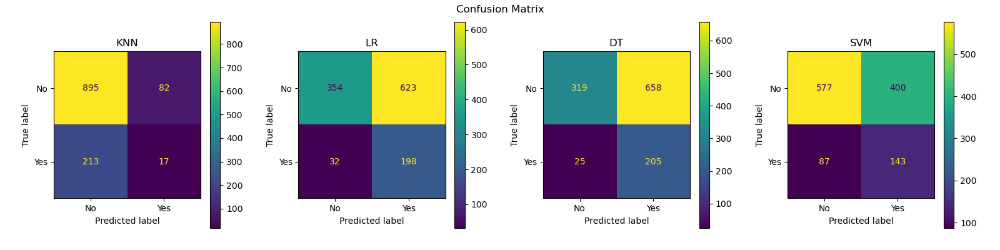

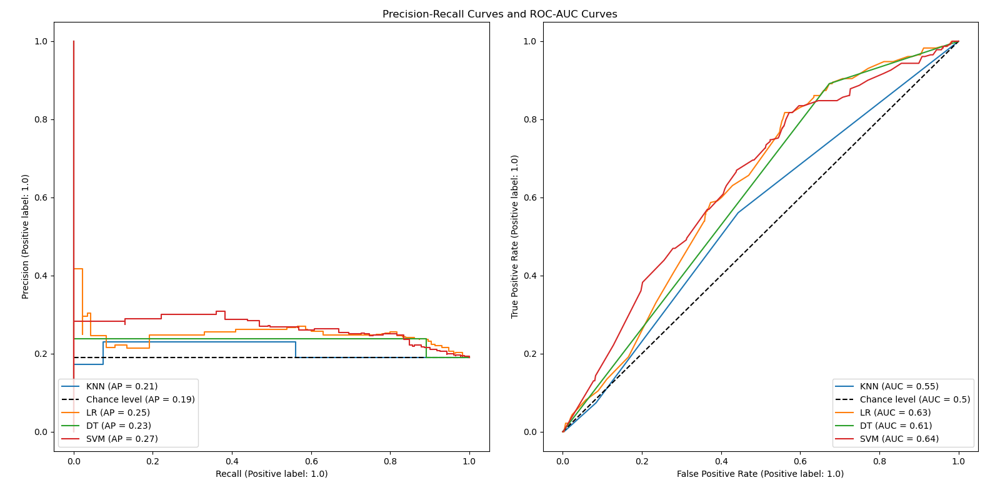

**Given that, SVM and KNN were eliminated and LR and DT continued to be evaluated on the full 7-feature-dataset.**

### **5.2 Train and Select models on the full 7-feature-dataset**

The scoring table below shows that LR and DT have similar performance.

| Model         | Train Time | F1 - Train      | F1 - Val        | F1 - Test | Balanced Accuracy - Train | Balanced Accuracy - Val | Balanced Accuracy - Test |
| ------------- | ---------- | --------------- | --------------- | --------- | ------------------------- | ----------------------- | ------------------------ |
| Baseline      | 0.40       | 0.00 (+/- 0.00) | 0.00 (+/- 0.00) |           | 0.50 (+/- 0.00)           | 0.50 (+/- 0.00)         |                          |
| **LR - Full** | **24.20**  | 0.40 (+/- 0.00) | 0.40 (+/- 0.02) | **0.40**  | 0.63 (+/- 0.00)           | 0.63 (+/- 0.02)         | **0.63**                 |
| **DT - Full** | **5.67**   | 0.40 (+/- 0.00) | 0.39 (+/- 0.02) | **0.40**  | 0.63 (+/- 0.00)           | 0.62 (+/- 0.02)         | **0.63**                 |

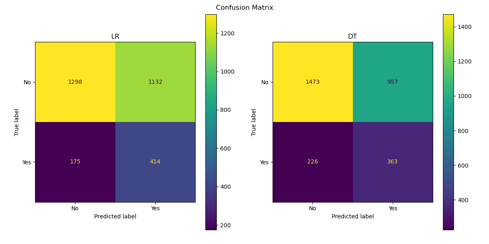

One of the considerable benefits of DT is its ease of interpretation. The model can be illustrated by a decision tree which we are all familiar with given that we create decision trees in our mind every day for many daily decisions such as where to have dinner or what to do this weekend.

**DT was selected for its performance, speed and ease of interpretation.**

## **6. Evaluation**

## 6.1 Interpretation

**Confustion Matrix**

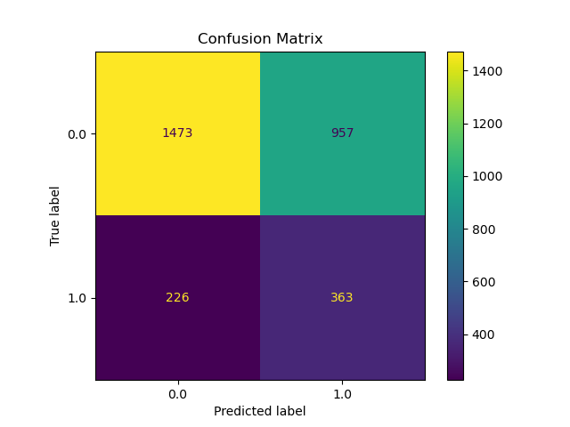

The above confusion matrix can be interpreted as follows:

- In the test set, there are xx positive or “subscribed” observations and the model correctly predicted … instances but missed xxx positive instances. 

- Of xxx negative instances, it correctly classified xxx observations and incorrectly classified xxx observations.

The scores are summarized in the classification report below:

**Visualize the tree**

Decision Trees model allows us to visualize the decision tree to know exactly what happened inside the model and how the model made predictions. A Decision Trees diagram can be used as a flow chart to predict with input data or features. Starting at the root note, we follow the decision path and pass through interior nodes to arrive at a leaf note for the prediction. The tree is visualized below.

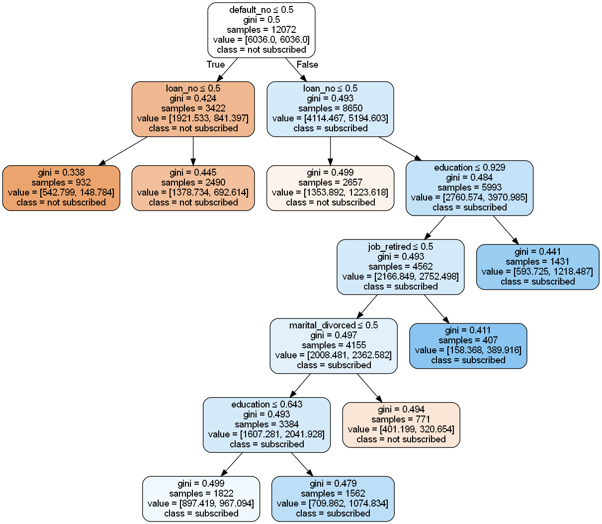

The tree shows at each step or each note which question was asked or which rule was used and how the answer would lead to the next step or node. The color of the boxes presents the class purity at the node: blue stands for ‘subscribed’ and orange represents ‘not subscribed’. The darker the color, the more pure the class is at that node. 
Based on the tree, the features that were used to make predictions are

To identify which features are most predictive to the selected model, two techniques were used: impurity-based importance and permutation feature importance.

### **6.2 Impurity-based importance**

The selected model is a tree-based model which allows us to obtain the feature importance directly from the model based on impurity or the mean decrease in impurity when building the tree. The top two features are **"default_no"** and **“education”**.

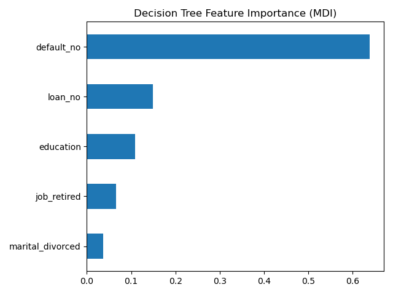

### **6.3 Permutation feature importance**

Permutation feature importance model inspection technique randomly shuffles a single feature value and consequently breaks the relationship between the feature and the target - price. The decrease in the model score indicates the level of dependency of the model to the feature and, therefore, how important the feature is to the model. Below are the results of permutation importance computed on both the trained set and the test set for the selected model. The top two features are **"default_no" and “education”**. The results are consistent with that of the impurity-based importance method.

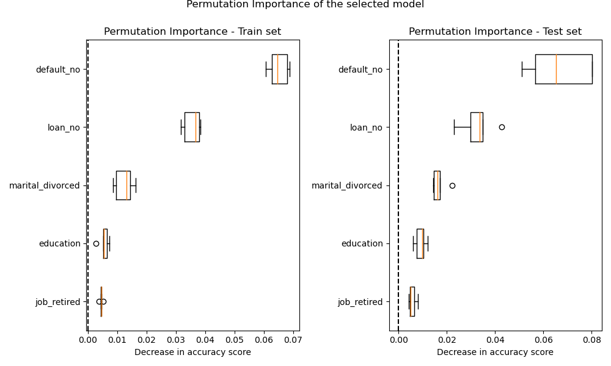

Features that are important on the trained set but not on the test set might cause the model to overfit. The similarity of the feature importance ranking between those two plots, train and test, suggests that the selected model is not overfitting.

In addition, when data contains strong multicollinear features, the results of permutation importance might be misleading in some cases. When a feature is permuted, the model can get the same information from the other correlated feature. Therefore, the performance of the model is not affected. This is not the case for the selected model because the permutation importance plot shows that permuting a feature drops the accuracy by 0.5. In addition, features which are strong collinear were paired and one of them was removed as part of the feature selection process.

## **7. Conclusion and Recommendations**

To identify a predictive classification model, seven features related to the bank client information of the Portuguese bank direct marketing dataset was explored and transformed. Four models named K-nearest Neighbors (KNN), Logistic Regression (LR), Decision Trees (DT), and Support Vector Machines (SVM) classification models were built and validated. These models were evaluated with a set of pre-defined evaluation metrics. They are speed, ease of interpretation and performance. The model with the highest quality was selected and inspected. The top two features that influenced the selected model the most are education and default_no (e.g. the client is not in the default status)

**Next steps:**

The project can be continued by further optimizing the performance of the models. Some examples are using all features of the original dataset and/or balancing the dataset.

## **8. Jupyter Notebook**

Please refer to the [Used Car Jupiter Notebook](https://github.com/TLe2023/CarPricePrediction/blob/main/UsedCarPricePrediction.ipynb) for more information.
